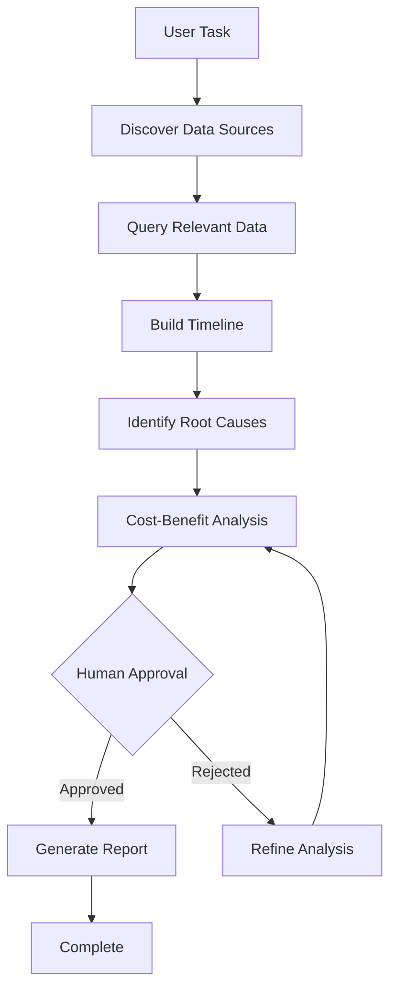

# Pharmaceutical Investigation Agent

A specialized agent for pharmaceutical supply chain investigations with human-in-the-loop (HITL) decision support.

## Overview

The Pharmaceutical Investigation Agent performs root cause analysis and CAPA (Corrective and Preventive Action) investigations for supply chain events **without hardcoding scenarios**. It dynamically:

- 🔍 Discovers available data sources
- 📊 Queries multiple CSV files to build complete picture
- ⏱️ Constructs accountability timelines
- 💰 Performs cost-benefit analysis
- 📝 Generates GxP-compliant reports
- ✋ Requests human approval for critical decisions

## Key Features

### ✅ No Hardcoded Scenarios
The agent works with **any** pharma supply chain data in CSV format. Point it at a data directory and it will:
- Discover what data sources exist
- Query them to understand the situation
- Build evidence-based reasoning chains
- Present findings for human review

### ✅ HITL Decision Support
Critical decisions (quarantine, release, rejection) require human approval:
- Agent presents findings and recommendations
- Cost-benefit analysis supports decision-making
- Human approves/rejects with feedback
- Agent adapts based on feedback

### ✅ GxP Compliance
Generates audit-ready investigation reports:
- Complete timeline with timestamps
- Accountability by responsible party
- Root cause analysis
- CAPA recommendations
- Approval signatures

## Quick Start

### 1. Enable the Agent

```python
from magentic_ui import MagenticUIConfig

config = MagenticUIConfig(
    pharma_agent_enabled=True,
    pharma_data_dir="mock_data",  # Your data directory
    approval_policy="auto-conservative",  # HITL approval
    cooperative_planning=True,
)
```

### 2. Organize Your Data

Structure your data directory with CSV files:

```
mock_data/
├── Sensor Data/
│   └── sensor_alerts.csv
├── Logistics Data/
│   └── logistics_shipments.csv
├── WMS/
│   ├── wms_quarantine_log.csv
│   ├── wms_goods_movements.csv
│   └── finance_waste_log.csv
└── Historical Trial Ops Data/
    └── supplier_performance_sla.csv
```

**No specific schema required!** The agent discovers columns dynamically.

### 3. Run an Investigation

```python
from magentic_ui.task_team import get_task_team
from magentic_ui.types import RunPaths
from pathlib import Path

# Setup paths
paths = RunPaths(
    internal_root_dir=Path.cwd(),
    external_root_dir=Path.cwd(),
    internal_run_dir=Path.cwd() / "run",
    external_run_dir=Path.cwd() / "run",
)

# Create team with pharma agent
team = await get_task_team(config, paths=paths)

# Run investigation
result = await team.run(
    task="Investigate shipment SHP-001-1 for temperature excursion"
)
```

## How It Works

### Investigation Flow



### Agent Tools

The agent has access to these dynamic data tools:

#### `discover_available_sources()`
Lists all CSV files in data directory with column metadata.

```python
# Agent discovers what data exists
sources = discover_available_sources()
# Returns: sensor_alerts, logistics_shipments, wms_quarantine_log, etc.
```

#### `query_data_source(source_name, filters, limit)`
Queries any CSV file with dynamic filtering.

```python
# Agent queries specific data
results = query_data_source(
    "sensor_alerts",
    filters={"shipment_id": "SHP-001-1", "alert_type": "TEMP_EXCURSION"},
    limit=10
)
```

#### `analyze_shipment_timeline(shipment_id)`
Joins multiple data sources to build accountability timeline.

```python
# Agent builds complete timeline
timeline = analyze_shipment_timeline("SHP-001-1")
# Returns: chronological events with timestamps and responsible parties
```

#### `compute_cost_analysis(shipment_id)`
Calculates expected value for different resolution options.

```python
# Agent provides decision support
analysis = compute_cost_analysis("SHP-001-1")
# Returns: cost scenarios (release vs reject) with expected values
```

#### `generate_compliance_report(shipment_id, investigation_data)`
Creates GxP-compliant investigation report.

```python
# Agent generates audit documentation
report = generate_compliance_report("SHP-001-1", findings)
# Returns: structured report with CAPA, approvals, etc.
```

## Integration with Magentic-UI

The pharma agent integrates **seamlessly** with existing magentic-ui:

### Backend Integration

Located in `src/magentic_ui/agents/pharma_investigation.py`, the agent:
- Uses standard AutoGen `ConversableAgent` pattern
- Registers tools using AutoGen tool registration
- Works with existing approval guard system
- Participates in group chat orchestration

### Frontend Integration

Works with existing UI components:

- **Chat Interface**: Agent messages appear in chat view
- **Approval Buttons**: Human approves/rejects recommendations
- **Detail Viewer**: Shows data query results
- **Plan View**: Displays investigation steps

No frontend changes needed! The agent works with existing HITL infrastructure.

### Configuration

Two new config options in `MagenticUIConfig`:

```python
pharma_agent_enabled: bool = False  # Enable pharma agent
pharma_data_dir: str = "mock_data"  # Data directory path
```

## Example: Temperature Excursion Investigation

### User Query
```
"Investigate shipment SHP-001-1 for temperature excursion during transit"
```

### Agent Flow

1. **Discover Data**
   ```
   Agent: "Discovering available data sources..."
   Found: sensor_alerts, logistics_shipments, wms_quarantine_log, etc.
   ```

2. **Query Events**
   ```
   Agent: "Querying sensor_alerts for SHP-001-1..."
   Found: TEMP_EXCURSION at 29.3°C (threshold: 25°C)
   ```

3. **Build Timeline**
   ```
   Agent: "Building accountability timeline..."
   Timeline:
   - 2024-01-15 08:00: Shipment dispatched (Carrier_C101)
   - 2024-01-15 14:30: Temperature exceeded 25°C (Environmental)
   - 2024-01-15 15:00: Alert triggered (System)
   - 2024-01-15 16:00: Shipment quarantined (QA_Team)
   ```

4. **Analyze Costs**
   ```
   Agent: "Computing cost-benefit analysis..."
   Option 1: Conditional Release ($500 QA review, 85% success)
   Option 2: Reject & Reship ($5,200 total, 100% success)
   Recommendation: Conditional release (lower expected cost)
   ```

5. **Request Approval** ✋
   ```
   Agent: "Requesting human approval for conditional release..."
   [User sees approval prompt in UI]
   ```

6. **Generate Report**
   ```
   Agent: "Generating GxP-compliant investigation report..."
   Report ID: CAPA-SHP-001-1-20240115
   ```

## Data Requirements

### Minimal Requirements

The agent works with **any** CSV structure, but investigations are more effective with:

- **Identifiers**: Common IDs to join data (shipment_id, lot_id, etc.)
- **Timestamps**: Event timestamps for timeline construction
- **Ownership**: Fields indicating responsible parties
- **Status**: Current state fields (quarantined, released, etc.)

### Recommended Data Sources

For supply chain investigations:

1. **Shipment Data**: Routes, carriers, dispatch/arrival times
2. **Sensor Data**: Temperature, humidity, shock alerts
3. **Warehouse Data**: Quarantine logs, goods movements
4. **Financial Data**: Waste logs, cost tracking
5. **Quality Data**: Test results, deviations
6. **Supplier Data**: Performance metrics, SLA compliance

### CSV Format

Any CSV format works! The agent discovers columns dynamically:

```csv
shipment_id,alert_type,threshold,actual_value,timestamp,severity
SHP-001-1,TEMP_EXCURSION,25.0,29.3,2024-01-15T14:30:00,HIGH
SHP-001-2,DELAY,48,72,2024-01-16T09:00:00,MEDIUM
```

## Advanced Usage

### Custom Investigation Prompts

Guide the agent's investigation process:

```python
investigation_prompt = """
Investigate shipment {shipment_id}.

Focus areas:
1. Temperature control during transit
2. Carrier compliance with SOPs
3. Financial impact of potential waste
4. Regulatory implications

Provide:
- Root cause analysis with evidence
- Accountability by party
- CAPA recommendations
- Cost-benefit analysis
"""

result = await team.run(task=investigation_prompt.format(shipment_id="SHP-001-1"))
```

### Multi-Shipment Analysis

Investigate multiple shipments to find patterns:

```python
analysis_prompt = """
Analyze shipments SHP-001-1 through SHP-001-5.

Identify:
- Common root causes
- Systemic issues vs isolated incidents
- Supplier performance patterns
- Preventive actions to avoid recurrence
"""

result = await team.run(task=analysis_prompt)
```

### Custom Data Directory

Point agent at different data sources:

```python
config = MagenticUIConfig(
    pharma_agent_enabled=True,
    pharma_data_dir="/path/to/trial_123/data",  # Trial-specific data
)
```

## Extending the Agent

### Add Custom Tools

```python
from magentic_ui.agents.pharma_investigation import create_pharma_investigation_agent

def custom_risk_scoring(shipment_id: str) -> str:
    """Custom risk scoring logic."""
    # Your domain-specific logic
    return json.dumps({"risk_score": 0.75, "factors": [...]})

# Create agent with custom tools
agent = create_pharma_investigation_agent()
agent.register_for_llm(name="compute_risk_score")(custom_risk_scoring)
agent.register_for_execution(name="compute_risk_score")(custom_risk_scoring)
```

### Custom System Message

```python
custom_prompt = """
You are a pharmaceutical quality specialist focused on GMP compliance.
Always reference ICH guidelines Q9 (Quality Risk Management) in your analysis.
"""

agent = create_pharma_investigation_agent(
    system_message=custom_prompt
)
```

## Troubleshooting

### Agent Can't Find Data

**Problem**: "No CSV file found matching: sensor_alerts"

**Solution**: Check data directory path and file names
```python
# Verify data directory
from pathlib import Path
data_dir = Path("mock_data")
print(list(data_dir.rglob("*.csv")))  # List all CSV files
```

### Agent Provides Incomplete Analysis

**Problem**: Timeline missing events or accountability unclear

**Solution**: Ensure data has common identifiers and timestamps
```python
# Check if shipment_id exists across sources
query_data_source("sensor_alerts", filters={"shipment_id": "SHP-001-1"})
query_data_source("logistics_shipments", filters={"shipment_id": "SHP-001-1"})
```

### Human Approval Not Triggering

**Problem**: Agent proceeds without asking for approval

**Solution**: Check approval policy configuration
```python
config = MagenticUIConfig(
    approval_policy="auto-conservative",  # Not "never"
)
```

## Comparison with Sample.json

The `sample.json` file in the repo shows an **example episode** - one complete investigation flow. The pharma agent:

- ✅ **Generates similar episodes dynamically** for any shipment
- ✅ **Discovers data** instead of using hardcoded facts
- ✅ **Reasons from evidence** instead of pre-scripted responses
- ✅ **Adapts to any CSV structure** instead of fixed schema
- ✅ **Works with real HITL** instead of simulated conversations

Think of `sample.json` as a template showing what one investigation looks like. The pharma agent creates similar investigations on-demand for any scenario.

## Next Steps

1. **Try the Demo**: Run `python samples/sample_pharma_investigation.py`
2. **Test with Your Data**: Point agent at your own CSV files
3. **Customize Prompts**: Guide investigations toward your domain needs
4. **Add Custom Tools**: Extend with domain-specific analysis functions
5. **Integrate with UI**: Use existing magentic-ui interface for HITL

## Architecture

```
┌─────────────────────────────────────────────────────────────┐
│                     Magentic-UI Frontend                     │
│  (Chat, Approval Buttons, Plan View - No Changes Needed!)   │
└─────────────────────┬───────────────────────────────────────┘
                      │
┌─────────────────────┴───────────────────────────────────────┐
│                   GroupChat Orchestrator                     │
│  (Existing orchestrator manages team coordination)          │
└─────┬───────────────┬────────────────┬─────────────┬────────┘
      │               │                │             │
┌─────┴─────┐  ┌─────┴─────┐  ┌──────┴──────┐  ┌───┴────────┐
│WebSurfer  │  │   Coder   │  │ FileSurfer  │  │  Pharma    │ ← NEW!
│ (existing)│  │ (existing)│  │  (existing) │  │Investigator│
└───────────┘  └───────────┘  └─────────────┘  └─────┬──────┘
                                                      │
                                      ┌───────────────┴────────────┐
                                      │  Pharma Data Tools         │
                                      │  - discover_sources()      │
                                      │  - query_data()            │
                                      │  - analyze_timeline()      │
                                      │  - compute_costs()         │
                                      │  - generate_report()       │
                                      └────────────┬───────────────┘
                                                   │
                                      ┌────────────┴───────────────┐
                                      │   CSV Data Files           │
                                      │   (mock_data/*.csv)        │
                                      └────────────────────────────┘
```

## Contributing

To extend or improve the pharma agent:

1. **Add Tools**: New tools in `src/magentic_ui/tools/pharma_data.py`
2. **Enhance Agent**: Modify `src/magentic_ui/agents/pharma_investigation.py`
3. **Update Config**: Add options in `src/magentic_ui/magentic_ui_config.py`
4. **Test**: Use `samples/sample_pharma_investigation.py`

## License

Same as magentic-ui project (MIT License).

